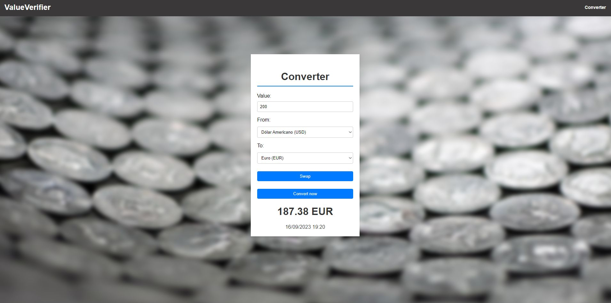

# ValueVerifier - Real-Time Currency Converter



The ValueVerifier is an application that provides real-time currency conversion using the free [ExchangeRatesAPI](https://exchangeratesapi.io). This project was developed with the aim of applying knowledge and acquiring new skills in the field of programming.

## Features

- Quick and easy real-time currency conversion.
- Utilizes the ExchangeRatesAPI to fetch up-to-date exchange rates.
- Intuitive and user-friendly interface.
- Automatic updates of exchange rates to keep data accurate.

## Technologies Used

The ValueVerifier project was developed using the following technologies:

- **HTML:** To structure the web page.
- **CSS:** For styling the user interface.
- **JavaScript:** For interactivity and data manipulation.
- **Django:** A high-level Python web framework used for building web applications.
- **Python:** The programming language used for server-side scripting and application logic.
- **ExchangeRatesAPI:** A free API for retrieving real-time exchange rates.


## How to Use

1. Clone this repository to your computer:

```bash
git clone https://github.com/Dcmaran/ValueVerifier
```
2. Create a virtual environment (venv) for the project. If you don't have virtualenv installed, you can install it using pip:

```bash
pip install virtualenv
```
3. Activate the virtual environment. The commands to activate the virtual environment vary depending on your operating system:

- On Windows:
```bash
venv\Scripts\activate
```

- On macOS and Linux:
```bash
source venv/bin/activate
```

4. Install the project dependencies from the requirements.txt file:
```bash
pip install -r requirements.txt
```

5. Migrate the database and create the necessary tables:
```bash
python manage.py migrate
```

6. Start the development server:
```bash
python manage.py runserver
```

7. Open your web browser and navigate to http://localhost:8000 to access the ValueVerifier application.


